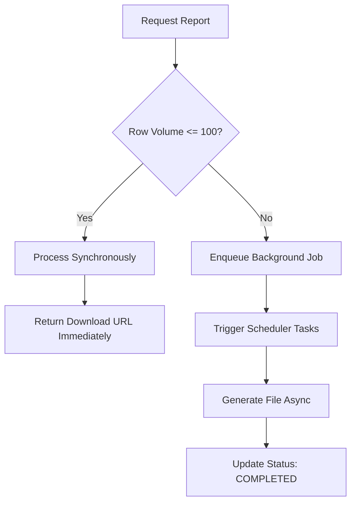

# Reporting Engine & Export Architecture

The Reports workspace (`/admin/reports`) compiles raw database ledger entries into downloadable formats.

## 1. Export Formats

The platform supports three export formats via the `ExportProvider` strategy pattern:
- **CSV (`CsvReportProvider`)**: Formats row data as comma-separated values.
- **Excel XML (`ExcelReportProvider`)**: Formats data using Excel-compatible XML schemas with custom grid headers.
- **PDF (`PdfReportProvider`)**: Emits text-structured tabular reports.

## 2. Sync vs. Async Execution Thresholds

To protect database performance from large query allocations, report generation is divided by row volume:

- **Synchronous Generation**: Queries containing 100 or fewer rows compile instantly.
- **Asynchronous Generation**: Queries with more than 100 rows register a background task in the `SchedulerService` queue, allowing portal operators to close the browser while the report processes in the background.
