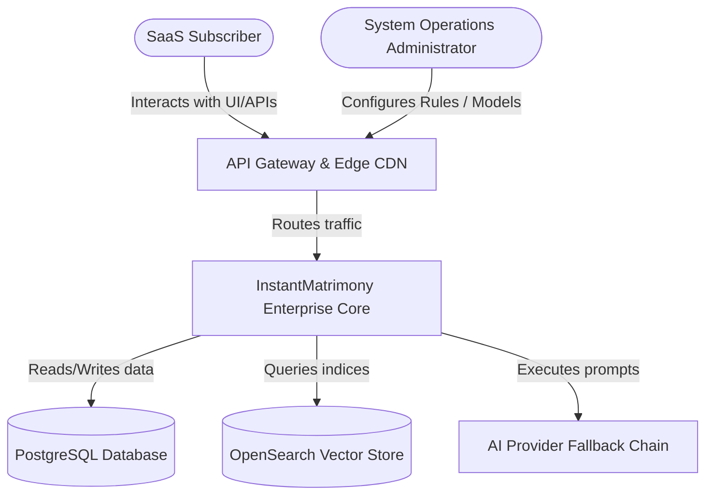
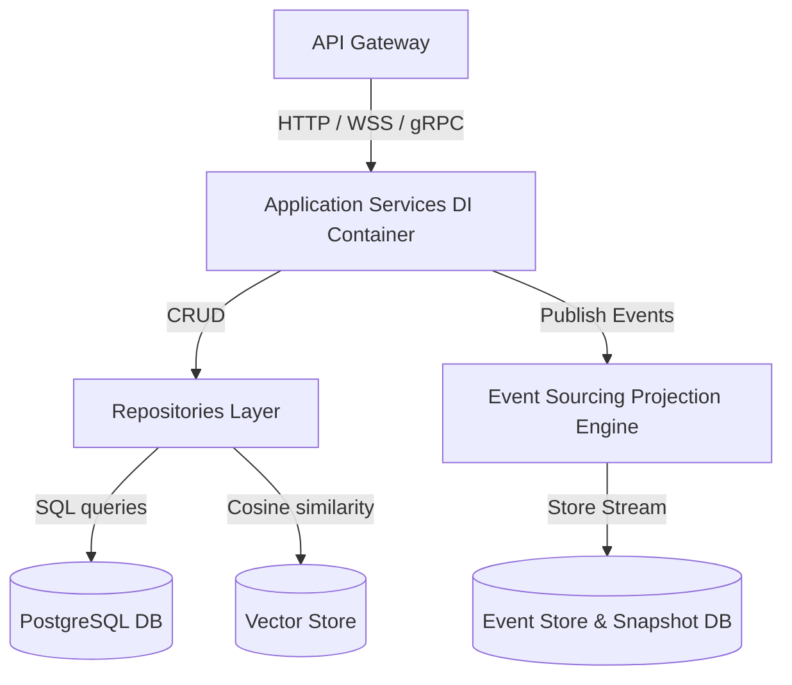
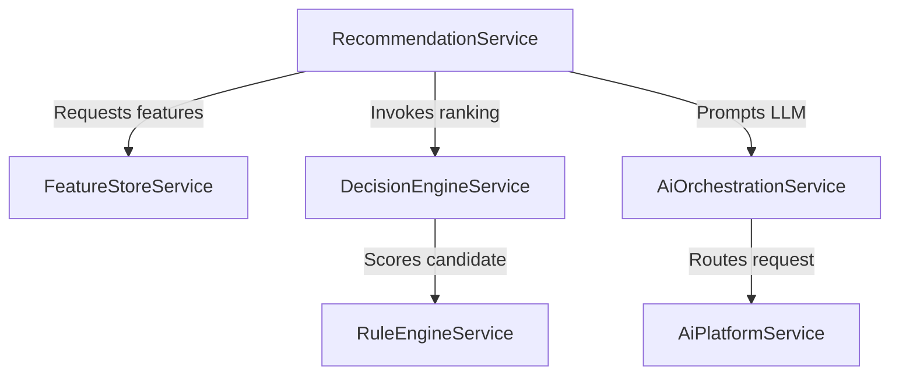
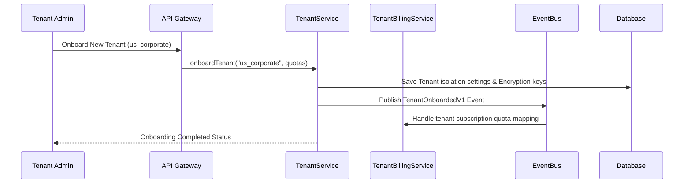

# Phase 5 Enterprise Architecture & System Documentation

This document outlines the System Design, C4 Models, Sequence Workflows, STRIDE Threat Modeling, and Operational Playbooks for the InstantMatrimony Phase 5 Enterprise Scale SaaS Platform.

---

## 1. C4 Architecture Models

### Level 1: System Context

### Level 2: Container Diagram

### Level 3: Component Diagram (AI Recommendation Engine)

---

## 2. Dynamic Workflow Sequence (Multi-Tenant Onboarding)

---

## 3. STRIDE Threat Model (AI Platform Security)

| Threat Category | Potential Risk | Mitigation Action |
| :--- | :--- | :--- |
| **Spoofing** | Unauthorized clients posing as enterprise tenants to access private embeddings. | Tenant Isolation Policy checks inside Gateway and `TenantService`. |
| **Tampering** | Model drift reports or audit snapshots modified by unauthorized DB edits. | Digital Signatures and SHA-256 hashes generated on Snapshot save. |
| **Repudiation** | Changes to AI cost budgets performed without traceability. | Immutable Audit Logs for all configuration mutations. |
| **Information Disclosure** | PII exposed in prompts sent to third-party LLM APIs. | Automated `EncryptionService` PII tokenization and masking filters. |
| **Denial of Service** | Rogue tenant exhausts OpenAI token quota, blocking others. | Token Budgeting and rate limiting checked in `AiPlatformService`. |
| **Elevation of Privilege** | Normal user calling Admin CMS rollbacks. | Policy Engine RBAC / ABAC token checks. |

---

## 4. Operational Playbook: AI Cost & Failover Runbook

### Alert Trigger: `AIBudgetExceededV1`
When an AI budget limit is breached, the platform automatically halts high-cost completions and falls back to cheap local/mock providers.

### Manual Reset Actions
1. Navigate to the Admin Operations Console.
2. Authenticate using MFA token.
3. Call `AiPlatformService.resetBudget()` action.
4. Verify system capacity usage metrics.
